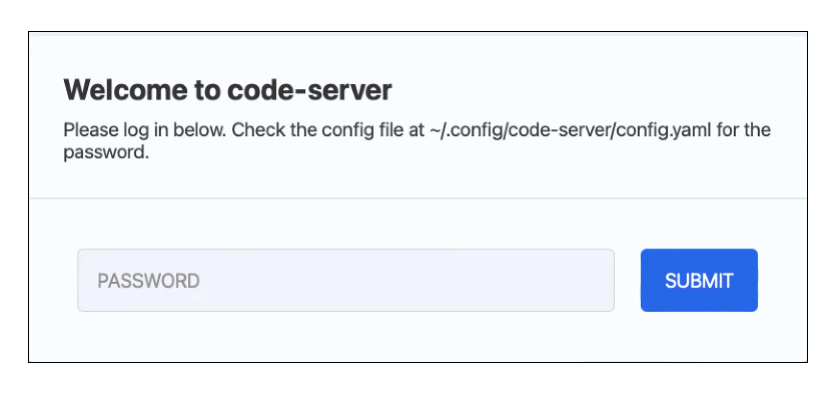
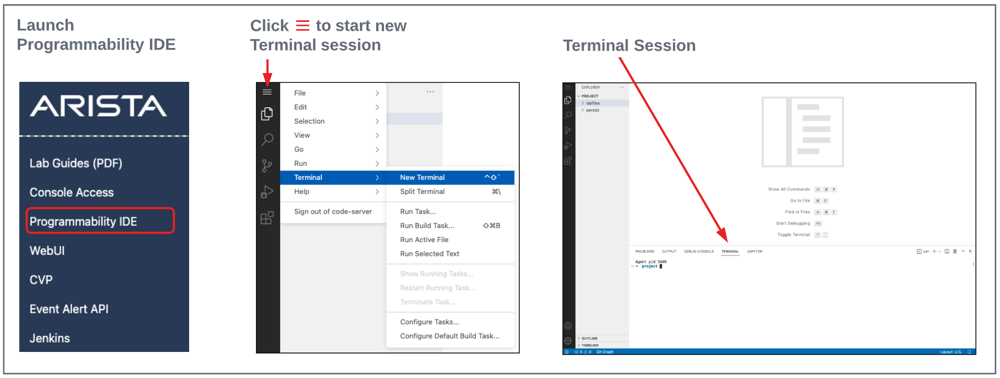
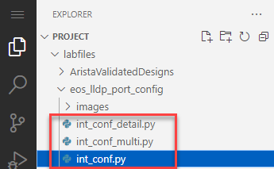
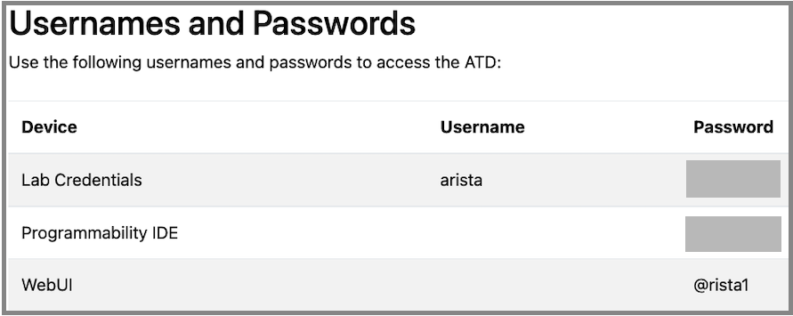

# Arista EOS Simple Scripting

This repo is meant to serve as an introduction to simple scripts that can be ran within the Arista Test Drive (ATD) environment. Initially, the focus will be configuring interfaces but the options are limitless when you get creative.

*Disclaimer: The code contained in this repository is meant to be clear and easily understood to someone new to network automation and therefore is not as condensed or optimized.  There are tons of other great repos that will be linked for more advanced users*

## Summary of Steps

1. [Launch Programmability IDE](#step-1---launch-programmability-ide)
2. [Change Working Directory and Git Clone](#step-2---change-working-directory-and-git-clone)
3. [Update Passwords](#step-3---update-passwords)
4. [Let the fun begin 🚀](#step-4---Let-the-fun-begin)

## STEP #1 - Launch Programmability IDE

- Launch the Progammability IDE.  If this is the first time starting the IDE you will be prompted for a code-server password.  Your unique password is noted on the Lab Topology page.



- Click through any pop-ups that may occur.
- Start a new terminal session by clicking on the hamburger and selecting Terminal->New Terminal.



## STEP #2 - Change Working Directory and Git Clone

- Change working directory to `labfiles` and clone the repo. Finally, change directory to `./eos_lldp_port_config`. You can either manually type in the commands from the following code block or there is a copy option if you hover to the right.

``` bash
cd ./labfiles
git clone https://github.com/daadam4/eos_lldp_port_config.git
cd ./eos_lldp_port_config/
```

## STEP #3 - Update Passwords

- For each of the files in the image below



- the following line needs to be updated with the password from your ATD environment, leaving all other variables the same.

`node = pyeapi.client.connect(host=ip_address, username='arista', password='password', transport='https', return_node=True)`

- For example if my password were `arista1234` the line would read

`node = pyeapi.client.connect(host=ip_address, username='arista', password='arista1234', transport='https', return_node=True)`

- Your credentials can be found near the bottom of the ATD landing page



## STEP #4 - Let the fun begin🚀

- The recommended order of running the scipts is as follows. Each subsequent builds on the previous by adding simple features and ends with a practical application of how this could be useful in your network:

```bash
python3 int_conf.py
python3 int_conf_multi.py
python3 int_conf_detail.py```

- The code has comments throughout that should make it clear what is occuring at each point of the script.